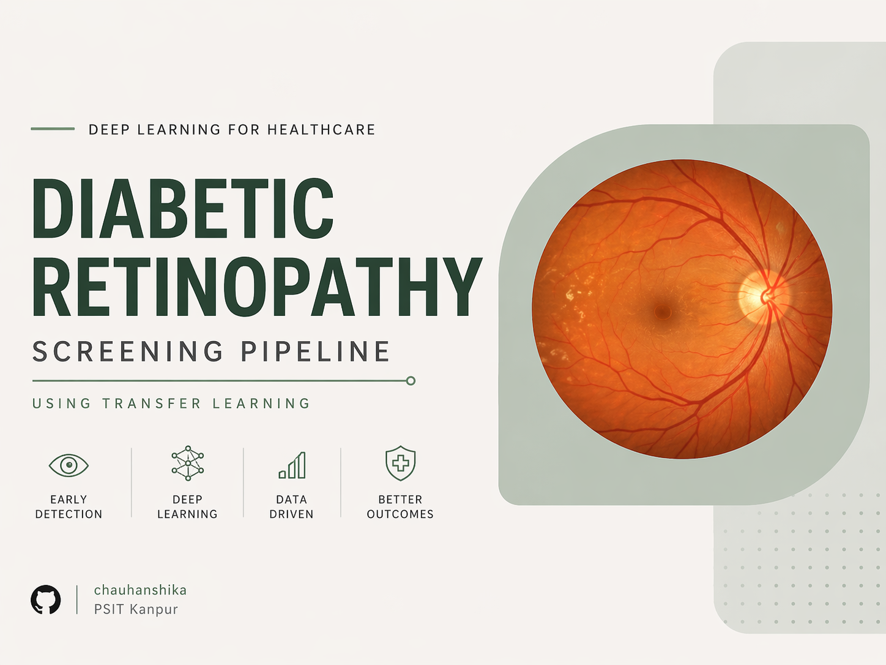

# Diabetic Retinopathy Screening Pipeline using Transfer Learning

<div align="center">



[](https://python.org)
[](https://tensorflow.org)
[](https://scikit-learn.org)
[](https://pandas.pydata.org)
[](LICENSE)

### End-to-End Clinical Data Science Pipeline for Diabetic Retinopathy Detection

*Developed a production-oriented diabetic retinopathy screening pipeline using Transfer Learning, Data Science evaluation, model benchmarking, misclassification analysis, and deployment-focused clinical interpretation with InceptionV3 and ResNet152.*

[Features](#-key-features) • [Results](#-model-performance) • [Installation](#-getting-started) • [Models](#-pretrained-models)

---

</div>

## About The Project: Clinical Deep Learning + Data Science

Diabetic Retinopathy (DR) is one of the leading causes of blindness worldwide. This project focuses on building an end-to-end screening system using Deep Learning and strong Data Science evaluation principles rather than stopping at simple model training.

This repository emphasizes:

* Exploratory Data Analysis (EDA)
* Transfer Learning with CNN architectures
* Model Benchmarking (InceptionV3 vs ResNet152)
* Misclassification Analysis
* False Negative Clinical Risk Evaluation
* Threshold Sensitivity Analysis
* Deployment Suitability Assessment

The objective is not just better accuracy, but safer and more reliable real-world healthcare deployment.

Unlike basic ML projects, this repository is structured for interview-safe production-grade explanation and clinical decision support. Because “model trained successfully” is not a business strategy.

---

## Data Science Methodology & Project Integrity

### Raw Dataset Availability

Due to GitHub file limits and medical data handling best practices, the raw retinal image dataset (`im1_balanced`) is excluded from this repository.

The codebase safely handles dataset absence and uses preserved metric outputs for reproducible evaluation.

### What Is Measured vs Generated

Training scripts generate:

* `classification_report.json`
* `confusion_matrix.json`
* `training_metrics.json`
* `roc_curve_data.json`

All notebooks, CSV benchmarking, and evaluation dashboards are generated directly from these saved outputs, not manually inferred.

### EDA Without Raw Images

The notebook `EDA_and_Data_Insights.ipynb` includes:

* Duplicate image detection using MD5 hashing
* Brightness distribution analysis using Pillow
* Validation class distribution mapping
* Safe absent-data execution handling

This ensures reproducibility even when raw medical images are not pushed to GitHub.

---

## Real-World Clinical Impact

This project is designed for deployment-oriented healthcare workflows:

* Automated early screening support
* Reduction of ophthalmologist workload
* High-risk patient triage prioritization
* Rural healthcare applicability
* Transparent diagnostic failure analysis

Special focus is given to False Negatives, since missing an actual diabetic retinopathy case is clinically far more dangerous than a false alarm.

Machines can be wrong. Medicine prefers they be wrong in safer ways.

---

# Model Performance

## Best Model Achievement

```text
┌─────────────────────────────────────────────────────────┐
│                  BEST ACCURACY: 79.13%                 │
│                   AUC Score: 0.86                      │
│          Model: InceptionV3 + Fine Tuning              │
└─────────────────────────────────────────────────────────┘
```

---

## Accuracy Comparison Across Experiments

| Model                  |   Accuracy | Precision |   Recall | F1-Score |      AUC |
| ---------------------- | ---------: | --------: | -------: | -------: | -------: |
| **InceptionV3 (Best)** | **79.13%** |  **0.80** | **0.79** | **0.79** | **0.86** |
| InceptionV3 v2         |     77.50% |      0.78 |     0.77 |     0.77 |     0.86 |
| InceptionV3 v3         |     77.00% |      0.78 |     0.77 |     0.76 |        - |
| InceptionV3 v4         |     76.00% |      0.78 |     0.76 |     0.75 |        - |
| InceptionV3 v5         |     74.00% |      0.79 |     0.74 |     0.73 |        - |
| ResNet152              |     77.31% |         - |        - |        - |        - |

---

## Best Model Classification Report

```text
              precision    recall  f1-score   support

    Abnormal     0.7154    0.8161    0.7624       348
      Normal     0.8581    0.7740    0.8139       500

    accuracy                         0.7913       848
   macro avg     0.7867    0.7950    0.7881       848
weighted avg     0.7995    0.7913    0.7928       848
```

---

## Core Data Science Notebooks

### EDA and Analysis

* `EDA_and_Data_Insights.ipynb`
* `misclassification_analysis.ipynb`
* `data_science_evaluation.ipynb`

### Benchmarking Files

* `model_comparison.csv`
* `model_deep_evaluation.csv`
* `classwise_metrics.csv`

### Clinical Interpretation

* `model_interpretation.md`
* `clinical_decision_notes.md`

These are intentionally included to show decision quality, not just accuracy screenshots.

Recruiters love numbers. Good recruiters love reasoning behind numbers.

---

# Key Features

## Advanced Deep Learning

* Transfer Learning using InceptionV3
* ResNet152 model benchmarking
* Two-stage training (Frozen Backbone + Fine Tuning)
* Strong clinical evaluation focus

## Data Science Evaluation

* Exploratory Data Analysis
* Confusion Matrix interpretation
* ROC Curve and AUC analysis
* Threshold sensitivity analysis
* Class imbalance risk evaluation
* False Negative risk analysis

## Production-Oriented Thinking

* Deployment suitability evaluation
* Clinical triage system design
* Edge clinic applicability
* Responsible healthcare model interpretation

Because “accuracy = 79%” means nothing if deployment logic is garbage.

---

# Tech Stack

## Programming & Analytics

* Python
* NumPy
* Pandas
* Scikit-learn
* Matplotlib
* OpenCV

## Deep Learning

* TensorFlow
* Keras

## Development

* Jupyter Notebook
* Git
* GitHub

---

# Project Structure

```text
Diabetic-Retinopathy-Screening-Pipeline/
│
├── assets/
│
├── inception_79%/          # Best model
├── inception_77.5%/
├── inception_77%/
├── inception_76%/
│
├── resnet_152_/
│
├── EDA_and_Data_Insights.ipynb
├── misclassification_analysis.ipynb
├── data_science_evaluation.ipynb
│
├── model_comparison.csv
├── model_deep_evaluation.csv
├── classwise_metrics.csv
│
├── requirements.txt
├── README.md
└── utility scripts
```

---

# Getting Started

## Installation

```bash
git clone https://github.com/chauhanshika/Diabetic_Retinopathy_Screening_Pipeline_using_Transfer_Learning.git

cd Diabetic_Retinopathy_Screening_Pipeline_using_Transfer_Learning

pip install -r requirements.txt
```

---

## Run EDA

```bash
jupyter notebook EDA_and_Data_Insights.ipynb
```

---

## Train Best Model

```bash
cd inception_79%
python 1.py
```

---

# Future Improvements

* Grad-CAM for explainable AI
* Ensemble learning for stronger performance
* Web-based clinical deployment
* Real-time ophthalmology support system
* API-first deployment pipeline using FastAPI

Because every project eventually becomes “we should probably build an API.”

---

# Author

**Chauhanshika**
B.Tech CSE (Data Science)
PSIT Kanpur
Focused on Data Science, ML Systems, and production-grade AI solutions.

---

Built with clinical relevance, deployment thinking, and significantly more debugging than should be legally required.
