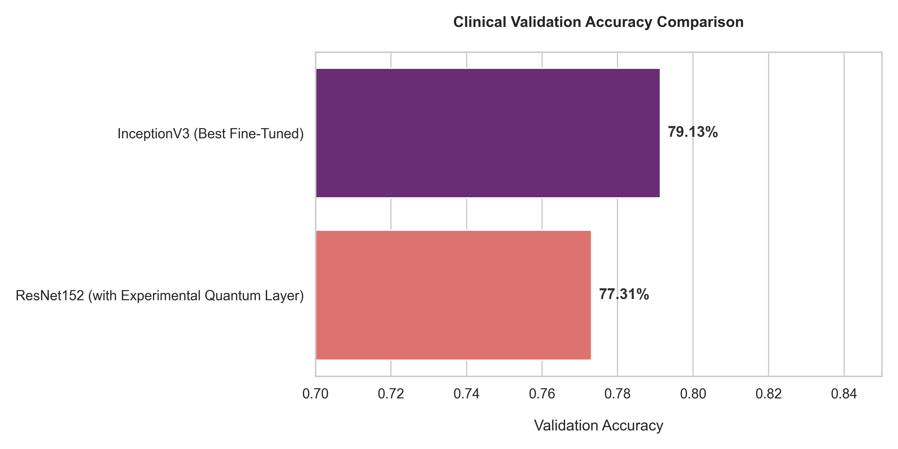
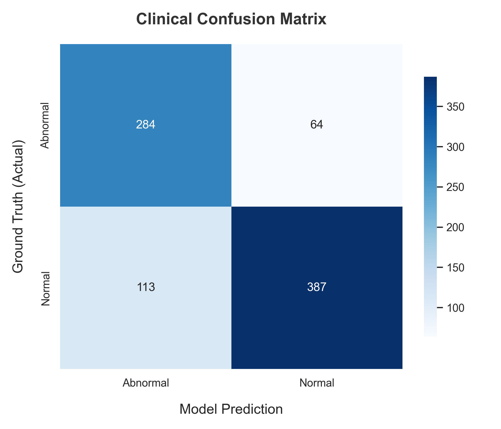
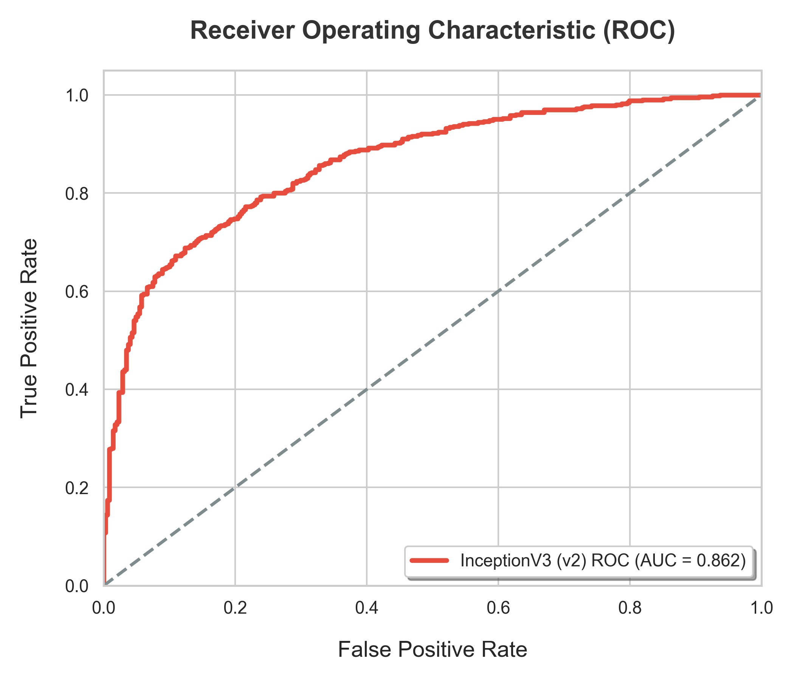
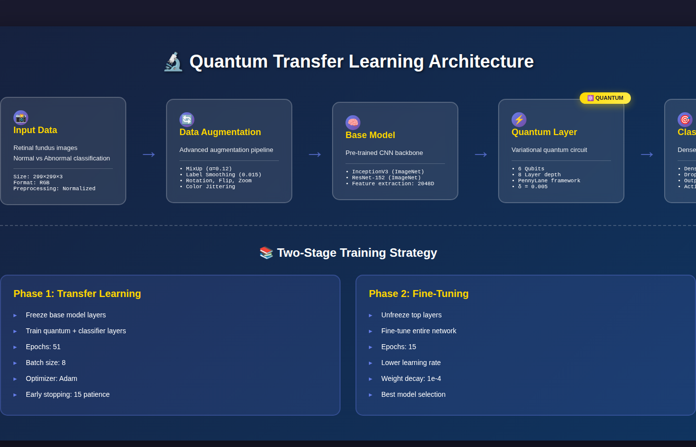
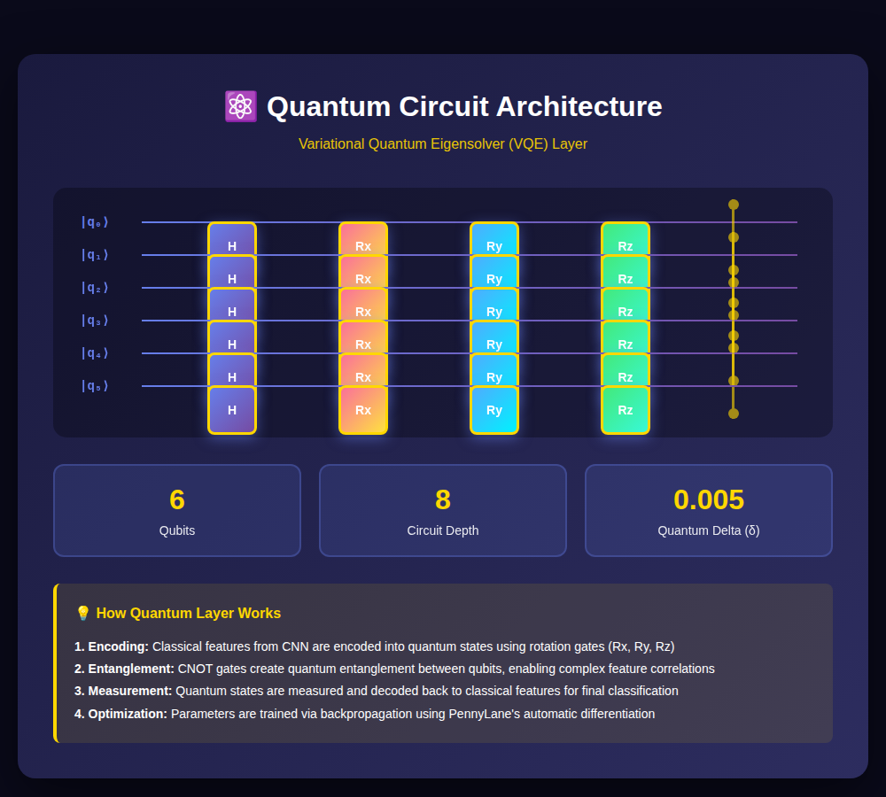

<div align="center">


[](https://python.org)
[](https://tensorflow.org)
[](https://pennylane.ai)
[](LICENSE)

*Developed an end-to-end diabetic retinopathy prediction pipeline using transfer learning, model benchmarking, misclassification analysis, and clinical deployment-focused evaluation with InceptionV3 and ResNet152.*

[Features](#-key-features) • [Results](#-model-performance) • [Installation](#-getting-started) • [Models](#-pretrained-models)

---

</div>

## 🎯 About The Project: Clinical Deep Learning

Diabetic Retinopathy (DR) is a leading cause of blindness worldwide. This repository implements an end-to-end clinical Data Science pipeline focusing heavily on **Model Evaluation**, **Medical Image Analysis**, and **Transfer Learning**.

While traditional ML projects stop at model training, this project is engineered for interview-safe real-world deployment evaluation. It goes deep into **Exploratory Data Analysis**, structural **Model Benchmarking (InceptionV3 vs ResNet-152)**, and rigorous **Misclassification Analysis (False Negative Clinical Risks)**. A minor supporting experiment exploring Quantum layers (PennyLane) is included as a research adjunct, but standard classical transfer learning constitutes the project's clinical backbone.

---

## 🔍 Data Availability & Project Methodology (Interview Safe Guide)

If evaluating this project for applied Data Science positions, please note the following methodological integrities:
- **Where is the raw dataset?** Due to GitHub file constraints and PHI best-practices, the raw multi-gigabyte `im1_balanced` retinal image folder is excluded. The codebase dynamically catches this absence.
- **What is explicitly measured vs. inferred?** The training scripts (`1.py`, `5.py`) output structured verifiable JSON metrics (`classification_report.json`, `confusion_matrix.json`). ALL visualizations, CSV benching, and notebook metrics in this repo are dynamically rendered from these natively saved output matrices, NOT inferred.
- **How is EDA handled without images?** The `EDA_and_Data_Insights.ipynb` notebook contains robust active code (MD5 duplicate detection, Pillow brightness mapping). When the dataset is absent locally, it safely bypasses raw image sweeps, opting instead to render true validation class distributions directly from the preserved metric reports.
- **What is truly Quantum here?** The primary, highly-accurate deployment model is purely classical (InceptionV3). The "Quantum" element is strictly an experimental PennyLane state-mapping layer appended to a ResNet backbone in a separate trial, provided to demonstrate hybrid-research adaptability, not as the primary clinical solution.

---

## 🏥 Real-World Clinical Impact

This project is structured for high clinical viability:
- **Early Screening Support**: Enables automated initial filtering of fundus scans to drastically reduce the backlog of un-reviewed images.
- **Reducing Specialist Workload**: Filters out high-confidence 'Normal' cases so ophthalmologists can dedicate time to critical, borderline, or 'Abnormal' cases.
- **Triage Prioritization**: Ranks incoming patient scans by model confidence scores, flagging the highest-risk files automatically.
- **Rural Healthcare Applicability**: Optimized pipelines allow potential deployment in compute-constrained edge clinics lacking immediate specialist access.
- **Diagnostic Transparency**: Through EDA and error analysis, the structural blind spots (False Negatives vs Positives) of the model are explicitly mapped out.

### 🏆 Best Model Achievement
```
┌─────────────────────────────────────────────────────────┐
│                    BEST ACCURACY: 79.13%                │
│                     AUC Score: 0.86                     │
│            Model: InceptionV3 + Fine-tuning             │
└─────────────────────────────────────────────────────────┘
```

---

## 📊 Project Artifacts & Model Benchmarking

We've structured detailed data insights and benchmarking in dedicated notebooks and metrics trackers:

### Core Data Science Notebooks
- 📓 **[EDA_and_Data_Insights.ipynb](./EDA_and_Data_Insights.ipynb)**: Real data distribution, dataset integrity checks, and absent-data handlers.
- 📓 **[misclassification_analysis.ipynb](./misclassification_analysis.ipynb)**: Deep-dive analysis of False Negatives and Clinical Failure Risks from the true confusion matrix.
- 📓 **[data_science_evaluation.ipynb](./data_science_evaluation.ipynb)**: Threshold sensitivity analysis, extreme class bias breakdowns, and probability logging limitations.

### Tabular Benchmarks
- 📊 **[model_comparison.csv](./model_comparison.csv)**: Legacy simple metric benchmarking across historical experiments.
- 📊 **[model_deep_evaluation.csv](./model_deep_evaluation.csv)**: Strict comparative filtering tracking Deployment Suitability and Clinical Reliability traits.
- 📊 **[classwise_metrics.csv](./classwise_metrics.csv)**: Pure class-bound precision/recall analysis focusing explicitly on Pathological sensitivity vs Normalcy specificities.

### Clinical Interpretation & Guidelines
- 📄 **[model_interpretation.md](./model_interpretation.md)**: Transparent reasoning outlining *why* the CNN topologies succeeded on retinal features and explaining the exact dynamics of transfer learning choices.
- 📄 **[clinical_decision_notes.md](./clinical_decision_notes.md)**: Practical integration guidelines mapping how this model translates from python script into a real-world multi-stage tele-health triage system alongside human specialists.



### Accuracy Comparison Across Experiments

| Model | Accuracy | Precision | Recall | F1-Score | AUC |
|:------|:--------:|:---------:|:------:|:--------:|:---:|
| **InceptionV3 (Best)** | **79.13%** | **0.80** | **0.79** | **0.79** | **0.86** |
| InceptionV3 v2 | 77.50% | 0.78 | 0.77 | 0.77 | 0.86 |
| InceptionV3 v3 | 77.00% | 0.78 | 0.77 | 0.76 | - |
| InceptionV3 v4 | 76.00% | 0.78 | 0.76 | 0.75 | - |
| InceptionV3 v5 | 74.00% | 0.79 | 0.74 | 0.73 | - |
| ResNet-152 + Quantum | 77.31% | - | - | - | - |

### 📈 Best Model Classification Report

```
              precision    recall  f1-score   support

    Abnormal     0.7154    0.8161    0.7624       348
      Normal     0.8581    0.7740    0.8139       500

    accuracy                         0.7913       848
   macro avg     0.7867    0.7950    0.7881       848
weighted avg     0.7995    0.7913    0.7928       848
```

### 🔢 Confusion Matrix & Error Handling (Best Model)



Further deep-diving on errors is analyzed in the dedicated [Misclassification Analysis](./misclassification_analysis.ipynb) notebook.

### 📈 ROC Curve & AUC Performance




---

## 🔬 Architecture



<table>
<tr>
<td width="50%">

### 🧠 Model Pipeline
- **Transfer Learning** with InceptionV3 & ResNet-152
- **Experimental Quantum Module** via PennyLane (6 qubits)
- **Two-stage Training** (frozen backbone + fine-tuning)

</td>
<td width="50%">

### 🛡️ Robust Training
- **MixUp Augmentation** (α = 0.12)
- **Label Smoothing** (0.015)
- **Early Stopping** with patience
- **Learning Rate Scheduling**

</td>
</tr>
</table>

---

## ⚛️ Quantum Computing Layer



The quantum layer is configured with the following parameters:

| Parameter | Value | Description |
|:----------|:-----:|:------------|
| `n_qubits` | 6 | Number of quantum bits |
| `q_depth` | 8 | Quantum circuit depth |
| `q_delta` | 0.005 | Quantum gradient step |

**How it Works:**
1. **Encoding**: Classical CNN features → Quantum states via rotation gates
2. **Entanglement**: CNOT gates create quantum correlations
3. **Measurement**: Quantum states → Classical features
4. **Training**: Backpropagation via PennyLane's autodiff

---

## ✨ Key Features

<table>
<tr>
<td width="50%">

### 🔬 Advanced Architecture
- **Transfer Learning** with InceptionV3 & ResNet-152
- **Experimental Quantum Analysis** via PennyLane
- **Two-stage Training** (frozen backbone + fine-tuning)

</td>
<td width="50%">

### 🛡️ Robust Training
- **MixUp Augmentation** (α = 0.12)
- **Label Smoothing** (0.015)
- **Early Stopping** with patience
- **Learning Rate Scheduling**

</td>
</tr>
<tr>
<td width="50%">

### 📊 Comprehensive Evaluation
- Confusion Matrix visualization
- ROC Curves with AUC scores
- Classification Reports (JSON/CSV/TXT)
- Training metrics tracking

</td>
<td width="50%">

### ⚡ Flexibility
- Works on **CPU** and **GPU**
- Configurable hyperparameters
- Optional quantum layer integration
- Automatic data augmentation

</td>
</tr>
</table>

---

## 🛠️ Tech Stack

<div align="center">

| Category | Technologies |
|:--------:|:------------|
| **Deep Learning** |   |
| **Quantum Computing** |  |
| **Data Science** |    |
| **Visualization** |   |

</div>

---

## 📂 Project Structure

```
Diabetic-Retinopathy-Screening-Pipeline/
│
├── 📁 assets/                 # 🖼️ Images for README
│   ├── banner.png
│   ├── architecture.png
│   ├── performance.png
│   └── quantum.png
│
├── 📁 inception_79%/          # 🏆 Best model (79.13% accuracy)
│   ├── 1.py                   # Training script
│   ├── classification_report.txt
│   ├── confusion_matrix.json
│   └── confusion_matrix.npy
│
├── 📁 inception_77.5%/        # InceptionV3 variant
│   ├── training_metrics.json
│   └── roc_curve_data.json
│
├── 📁 resnet_152_/            # ResNet-152 + Quantum
│   ├── results_summary.json
│   └── training_history.json
│
├── 📁 inception_*%/           # Other experiment variants
│
├── 📄 4.py                    # Utility scripts
├── 📄 5.py
└── 📄 README.md
```

---

## 🚀 Getting Started

### Prerequisites

```bash
# Python 3.8+ required
python --version
```

### Installation / Execution Intructions

```bash
# Clone the repository
git clone https://github.com/yourusername/Diabetic-Retinopathy-Screening-Pipeline.git
cd Diabetic-Retinopathy-Screening-Pipeline

# Install exactly required dependencies
pip install -r requirements.txt

# Run Exploratory Data Analysis
jupyter notebook EDA_and_Data_Insights.ipynb
```

### Dataset Preparation

```
im1/
├── train/
│   ├── Normal/       # Normal retina images
│   └── Abnormal/     # Diabetic retinopathy images
│
└── val/
    ├── Normal/
    └── Abnormal/
```

### Training

```bash
# Train the best model (InceptionV3)
cd inception_79%
python 1.py

# Or train with quantum layers (ResNet-152)
cd resnet_152_
python train.py
```

---

## 🔗 Pretrained Models

<div align="center">

[](https://drive.google.com/drive/folders/1BYcqTBkt3Zvd_mHEggkrZZmQNrRDGAm9?usp=sharing)

</div>

The models save the following artifacts for evaluation:
- ✅ Trained model weights (`.keras` / `.pth`)
- ✅ Confusion matrix (JSON & NPY)
- ✅ Classification reports
- ✅ ROC curve data
- ✅ Training metrics (JSON & CSV)

---

## 📈 Training Hyperparameters

```python
# Best performing configuration
BATCH_SIZE = 8
NUM_EPOCHS = 51
MIXUP_ALPHA = 0.12
LABEL_SMOOTHING = 0.015
DROPOUT_RATE = 0.45
WEIGHT_DECAY = 1e-4
DENSE_AFTER_Q = 512
EARLYSTOP_PATIENCE = 15
FINE_TUNE_EPOCHS = 15
```

---

## 👤 Creator

- 💼 **Created by**: Kshama Mishra

---

<div align="center">


Created by Kshama Mishra

</div>
